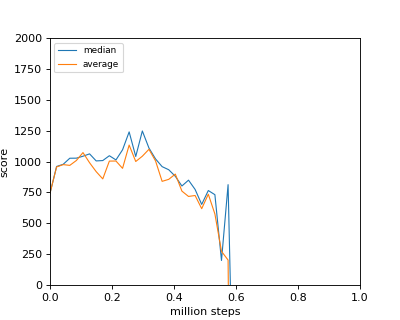
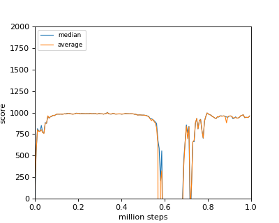
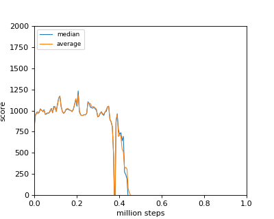
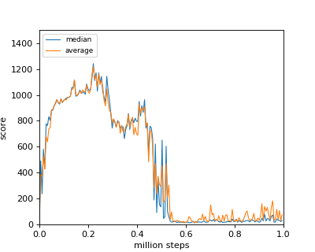

# chainer-naf
Reproduction code of Continuous Deep Q-Learning with Model-based Acceleration

See [this original paper](https://arxiv.org/abs/1603.00748) for details.

## Prerequisites

You will need [chainer](https://github.com/chainer/chainer), [chainerrl](https://github.com/chainer/chainerrl) and [OpenAI gym](https://gym.openai.com/) with [mujoco](http://www.mujoco.org/) to run the training.

Also install [this utility module](https://github.com/keio-ytlab/researchutils)

## Usage

Example

```sh
$ python main.py --env=Ant-v2 --gpu=0 --tau=0.005 --max-buffer-size=100000 --clip-grads --use-batch-norm
```

### 

|Parameter|Description|
|:---:|:---|
|outdir|Output directory for saving network parameters.|
|env|Name of the environment. Example: Ant-v2|
|gpu|Gpu number. If negative will train on cpu.|
|test-run|Run evaluation. If specified, the network will NOT be trained.|
|save-video|Save video on each episode. Defaults to false|
|q-params|Parameter file to load. If not specified, the network will be initialized with random weights.|
|total-timesteps|Total number of time steps to train.|
|learning-rate|Network parameter's learning-rate used for update. Defaults to 1e-4|
|gamma|Reinforcement learning's reward discount factor.|
|tau|Weight coefficient for target network's parameter update.|
|batch-size|Batch size of each training iteration.|
|evaluation-interval|Evaluation interval during training to check network's performance.|
|iterations|Number of network update for each step. Defaults to 5|
|max-buffer-size|Maximum replay buffer size.|
|parameter-shared-model|Use network which parameter's for mu, v, and L are shared among these 3 outputs.|
|clip-grads|Whether to clip gradients or not.|
|use-batch-norm|Whether to use batch normalization or not.|

## Results

### Ant-v2

In my environment learning rate between 1e-4 to 1e-5 was effective for training. Reward diverged with learning rate higher than 1e-4.

#### Shared parameter model (learining rate 1e-4)

(Best score: mean: 1134, median: 1241)

|result|score|
|:---:|:---:|
|  ||


#### Shared parameter model (learining rate 1e-5)

(Best score: mean: 1000, median: 1003)

|result|score|
|:---:|:---:|
|  ||

#### Independent parameter model (learning rate 1e-4)

(Best score: mean: 1189, median: 1223)

|result|score|
|:---:|:---:|
|  ||

#### Independent parameter model (learning rate 1e-5)

(Best score: mean: 1217, median: 1241)

|result|score|
|:---:|:---:|
|  ||
